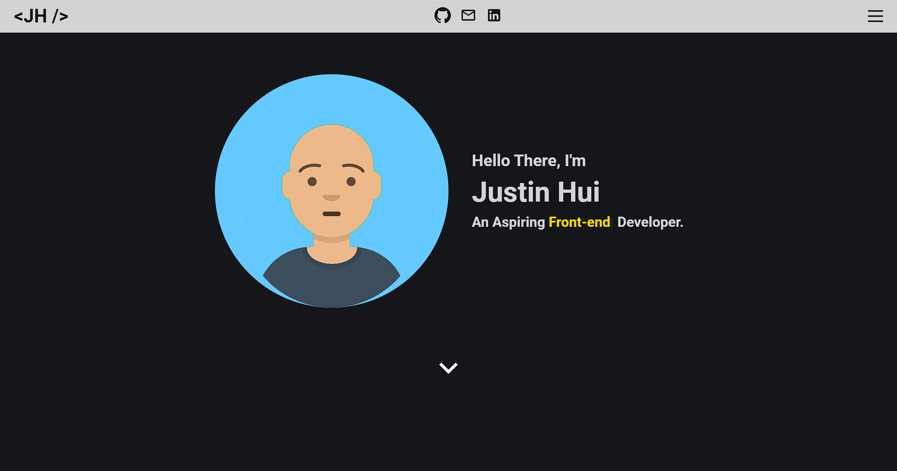
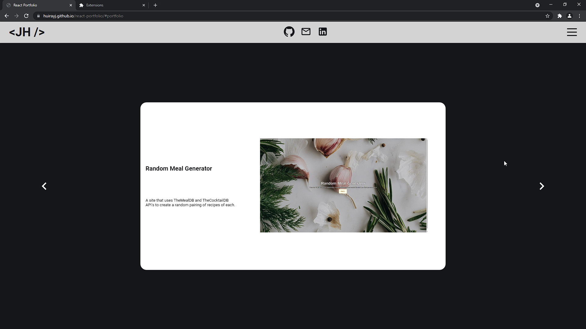
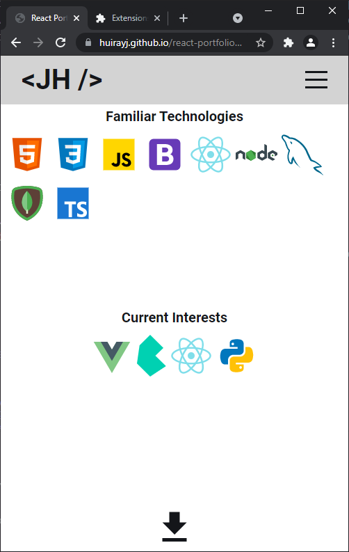

# Portfolio using React

## Overview

For this activity, a web developer portfolio is created using ReactJS. Components are put together and styled to create a professional looking website. In addition, a contact form with email validation is necessary.

## Table of Contents

  - [Installation](#installation)
  - [Usage](#usage)
  - [Technologies Used](#technologies-used)
  - [Links](#links)
  - [Resources](#resources)
  - [Screenshots](#screenshots)
    - [Desktop](#desktop)
    - [Mobile](#mobile)

## Installation

- Clone the repository to a specified folder.
- Run `npm i` in your terminal.

## Usage

- Run `npm run start` to start the server.

## Technologies Used

- Javascript
- React
- Sass

## Links

- [Repository](https://github.com/huirayj/react-portfolio)
- [Deployed Site](https://huirayj.github.io/react-portfolio/)
-

## Resources

- [ReactJS](https://reactjs.org/docs/getting-started.html)
- [Sass](https://sass-lang.com/documentation)

## Screenshots

### Desktop

### Mobile

